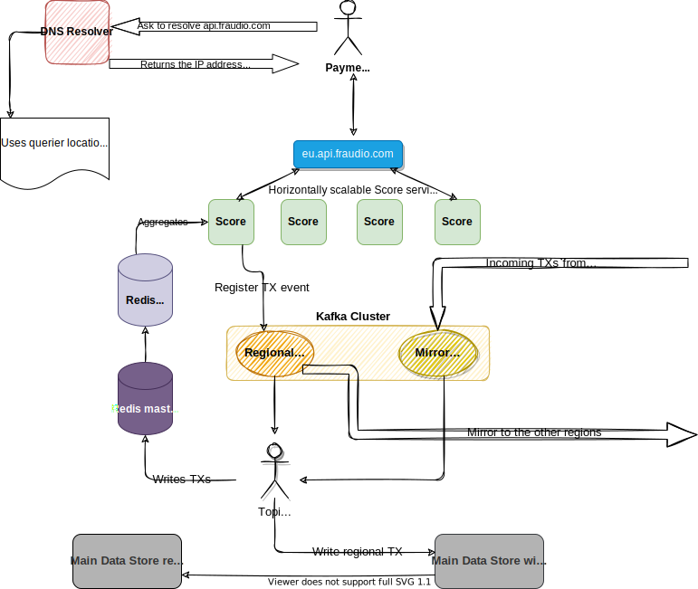
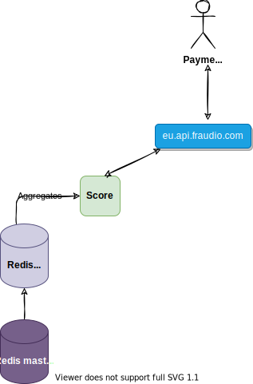
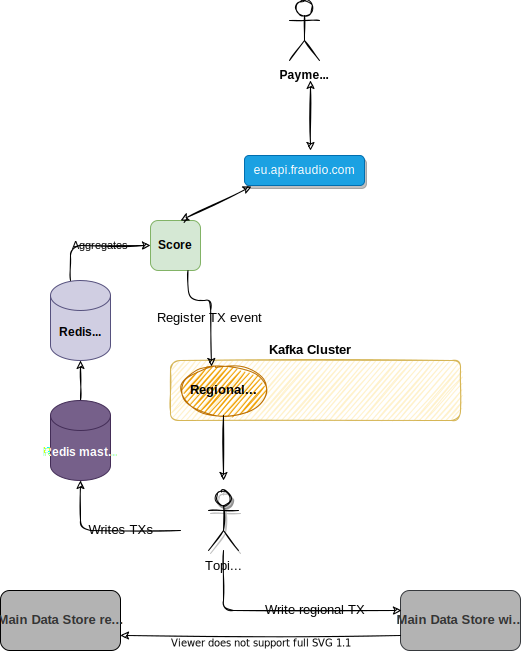
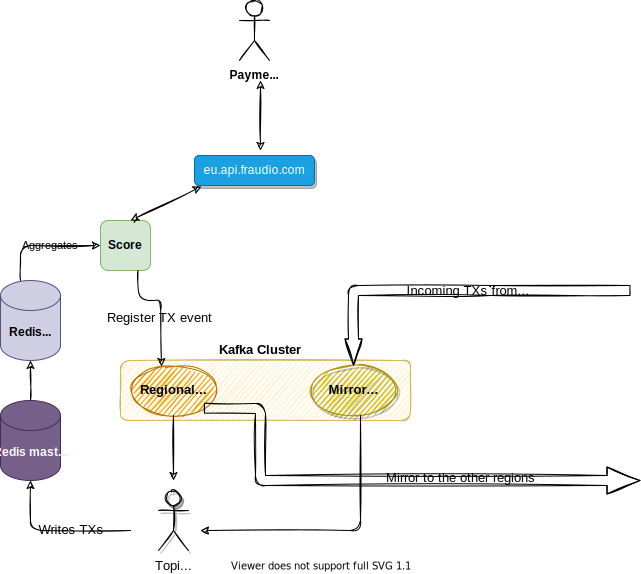

# Fraud Detection

What follows is a proposal for a fully distributed and fault-tolerant fraud detection system. I will start by providing a high-level explanation of the proposed architecture. Then, I'll do a deep dive into what I consider to be the crucial aspects that guarantee low latency responses while honoring the commitment of providing accurate fraud scores. I will also contrast the proposed architecture against other potential solutions and explain the trade-offs. Finally, I'll dedicate a section to propose some memory optimizations for Redis.

# Table of Contents
1. [High-level overview](#high-level-overview)
2. [Architecture deep-dive](#architecture-deep-dive)
   1. [Geo DNS](#geo-dns)
   2. [Redis for the aggregates](#redis-for-the-aggregates)
   3. [Event sourcing with Kafka](#event-sourcing-with-kafka)
   4. [Keeping global state](#keeping-global-state)
3. [References](#references)

# High-level overview

In a nutshell, each region will be self-sufficient in order to provide fraud scores to transactions, as requested by Payment Providers. Each region will have its own Redis cluster, used to provide and store aggregates per Credit Card, as well its own Kafka cluster. The purpose of the Kafka cluster is to make sure that each region has a global view of all the transactions for all the Credit Cards in near-realtime.

Finally, there is a main Data Store that stores all the transactions made globally by all the Credit Cards. This data can be used to warm up Redis cache (e.g. we we spin up a new region) as well as serve other purposes (e.g. some batch processes). The main Data Store has cross-region replication. This means that each region reads data from the regional read-replica, but writes data to a single master node.

# Architecture deep-dive

## Geo DNS

Before the Payment Providers can speak to Fraudio's API, they need to know its location (IP address). Instead of having the name resolution return A or AAAA records for any of the load-balancers, we can use GeoDNS instead.

GeoDNS will ensure that we can keep the latency to a minimum, by encouraging clients to speak with the nearest load-balancer (I mean encouraging because on the event of a full regional failure, the name resolution should still return records for the nearst non-regional load-balancer). As shown in the picture above, if the DNS resolve query originates in France, then the query response will contain A or AAAA records for `eu*.api.fraudio.com`. This is preferable to having the Payment Providers speak directly to `<region>.api.fraudio.com`, as it would force them to have knowledge of name schemas. It also gives us more control, as we can decide what routing policies to apply.

## Redis for the aggregates

Once the Payment Provider knows which endpoint it can speak to, it can make an HTTP request with the transaction. This HTTP request will be load-balanced to any of the Score services in that region, as they are stateless (hence horizontally scalable). The Score service, once receiving the transaction, asks Redis for the last 100 transactions made globally with that particular Credit Card. This information will be spreaded across a few different objects in Redis, but can be fetch in a single request. The read-replica is used for this purpose. The transaction must also be recorded, so the Score service writes the event (representing the transaction) to Kafka (more about this on the next section) and returns the response to the Payment Provider.

Redis allows us to store information using different data structures, in particular Sorted Sets. A sorted set is a dictionary that maps keys (strings) to scores (64-bit floating point numbers), keeping the keys ordered by score. For our use case, each key is the transaction ID and the score is the UTC timestamp that represents the exact moment the transaction took place. On the other hand, each transaction needs to be stored as an individual object (e.g. a Hash). Thus, fetching the last 100 transactions for a Credit Card involves identifying the right sorted (the key that identifies the sorted set can be the Credit Card number), returning the last 100 IDs ordered by score in reverse order (from most to least recent) and returning the objects associated to each of those IDs. This can be achieve either with 2 requests (if we use Redis *pipelines* for the second part) or one single request (if we use Redis *eval* with a Lua script).

## Event sourcing with Kafka

Once the Payment Provider sends a transaction to the Score service, a few things will happen:

1. The aggregated data for that particular Credit Card is fetched from Redis (as explained in the previous section).
2. An event (the transaction) is recorded.
3. The aggregated data and the transaction features are fed into the ML model to retrieve the score, which is then returned as an HTTP response.

Step number 2 is critical because it is responsible for recording that a transaction took place, without affecting the overall latency of the response. The best way to achieve this is in a "fire and forget" fashion. In short, the transaction data will be published to a particular topic in Kafka, which will then be consumed by a process that:

1. Records the transaction to the **Main Data Store**.
2. Updates the aggregated information in Redis (and also stores that particular transaction as an individual object).

The aggregated information for Credit Cards needs to be updated every time a transaction for that CC occurs. This means that the same transaction for which we want to get a score also needs to be stored. Instead of writing immediately to Redis and then to Kafka, we can simply write **only** to Kafka, to the regional topic (a topic that registers events that happen on that particular region). The consumers of that topic will then write the transaction to the Redis master as well as to the main Data Store. This introduces a bit of latency when registering the new transaction, but ensures that the score response is sent as quickly as possible to the Payment Provider.

## Keeping global state

As mentioned previously, each region should be self-sufficient to provide fraud scores to the Payment Providers. This means that each region must know what is happening in the other regions, and in the end all the regions must share the same global view. This is where Kafka mirroring comes in. Effectively, the Kafka Cluster in each region will have (at least) two topics: one topic that registers events that take place on that region (the *regional topic*) and another topic that mirrors (or replicates) what is happening in the other regions. The consumer processes on each topic will then write to the Redis master of the regional cluster, but **only** the consumer of the regional topic will write to the main Data Store. The reason for this is that whatever comes from the other regions has already been recorded by the consumer in that particular region (thus we can avoid unnecessary writes against the data store).

The advantage of using Redis Sorted Sets for aggregated information is that we won't have to merge and sort the events from both topics on each region: the score (UTC of each transaction) does the sorting for us automatically.

# Scalability and High-Availability

The nature of the Score service implies that the ratio of Redis read operations to write operations is 1:1, since every time we read the aggregates of a Credit Card we will also register the new transaction. The reads must happen faster than the writes, though, because we want to provide score responses within 100ms. Also, a high volume of requests is unlikely to be associated to the same Credit Card. In summary, the Redis cluster will be made of a master server (for write operations from the Kafka consumer) and read replicas, used by the Score service to fetch the aggregates.

The main Data Store is used to retrieve aggregate information for a Credit Card in case it doesn't exist in Redis yet (e.g. when we spin up a new region). For the sake of data locality, the main Data Store will have cross-region replication, where each region will fetch data from the corresponding read-replica.

# Fault-tolerance

On the event of service disruption in a particular region, the initial step of name resolution can still return the IP address of the Load-Balancer of the closest available region. This will, however, have an impact on the latency (the Payment Provider can decide to proceed if it doesn't get a response from us within 100ms).

# References

- [Amazon Route53 routing policies](https://docs.aws.amazon.com/Route53/latest/DeveloperGuide/routing-policy.html)
- [Kafka Geo-Replication](https://kafka.apache.org/documentation.html#georeplication)
- [Using Lua to implement multi-get on Redis hashes](https://beforeitwasround.com/2014/07/using-lua-to-implement-multi-get-on-redis-hashes.html)
- [Memory Optimization for Redis](https://docs.redislabs.com/latest/ri/memory-optimizations/)
