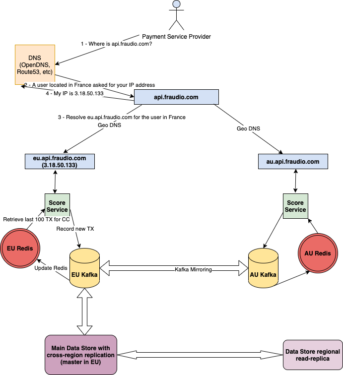

# Fraud Detection

What follows is the proposal for a fully distributed and fault-tolerant fraud detection system.

# Architecture Overview

The following diagram should give a birds-eye view of the proposed architecture.

